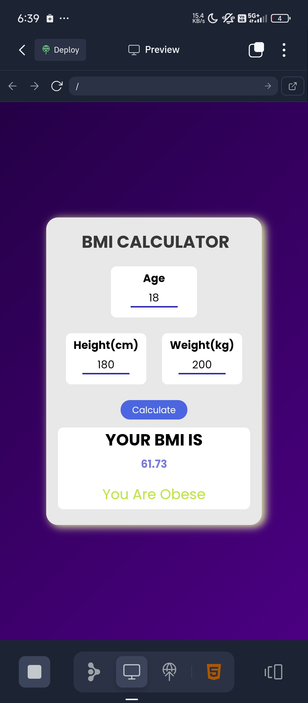

# BMI Calculator

This is a simple BMI (Body Mass Index) Calculator web project built with HTML, CSS, and JavaScript. It helps users calculate their BMI based on height and weight inputs. The project was created and tested primarily on a mobile device, so its appearance or functionality may vary on different platforms.

## Features

- User-friendly interface for entering height and weight
- Instant BMI calculation and result display
- Visual feedback using images
- Responsive design tested on mobile devices

## How to Use

1. Open the project in your browser.
2. Enter your height (in cm) and weight (in kg).
3. Click the "Calculate BMI" button.
4. See your BMI result and interpretation.

## Screenshots

Below are two images from the `images` folder that illustrate the BMI Calculator:

*BMI Input Screen*

*BMI Result Screen*

## Technologies Used

- **HTML**
- **CSS**
- **JavaScript**

## Note

These projects were built and tested on a phone. The layout and design may differ on desktops or other devices.

## License

This project is for educational purposes.
