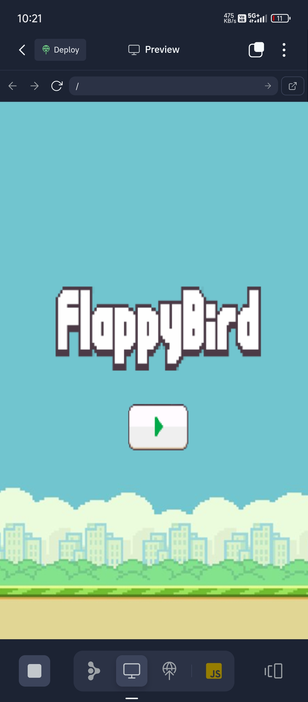

# Flappy Bird Game (Phone Edition)

<p align="center">
  
</p>

A simple, mobile-friendly Flappy Bird clone made using HTML, CSS, and JavaScript.  
Designed and tested entirely on a phone, this project is an easy way to learn game development basics and web programming on mobile devices.

## 🎮 Game Preview

<p align="center">
  
</p>

## How to Play

- **Tap** anywhere on the screen to make the bird flap and rise.
- Navigate through the gaps between the pipes.
- The game ends if the bird touches a pipe or the ground.
- Try to beat your high score!

## Features

- Responsive, works well on mobile browsers
- Classic Flappy Bird mechanics
- Simple UI with start and restart options
- Score tracking
- Easy codebase for beginners to understand and modify

## Tech Stack

- **HTML** for structure
- **CSS** for styling
- **JavaScript** for game logic and interactivity

## Getting Started

1. Clone the repository:
   ```bash
   git clone https://github.com/Praveen-Pradhan/WebDevProjectsInPhone.git
   ```
2. Open the `flappybird` folder (or relevant directory) on your phone using a code editor or file manager.
3. Open `index.html` in a mobile browser.
4. Tap the play button to start the game!

## Screenshots
| Start Screen                               | Gameplay                                  | Game Over Screen         |
|--------------------------------------------|--------------------------------------------|-------------------------|
|  |  |  |

*(Replace `flappybird.png`, `screenshot1.png`, and `gameover.png` with your actual image names from `flappybird/images` folder!)*
 

## Customization

Feel free to:
- Change bird and pipe graphics
- Tweak game difficulty (speed, gap size, etc.)
- Add sound effects or animations

## Credits

Developed by [Praveen Pradhan](https://github.com/Praveen-Pradhan)  
Inspired by the original Flappy Bird game.

## License

This project is open source and available under the [MIT License](LICENSE).

---

> **Note:** This project is optimized for mobile devices and may not work perfectly on desktop browsers.
