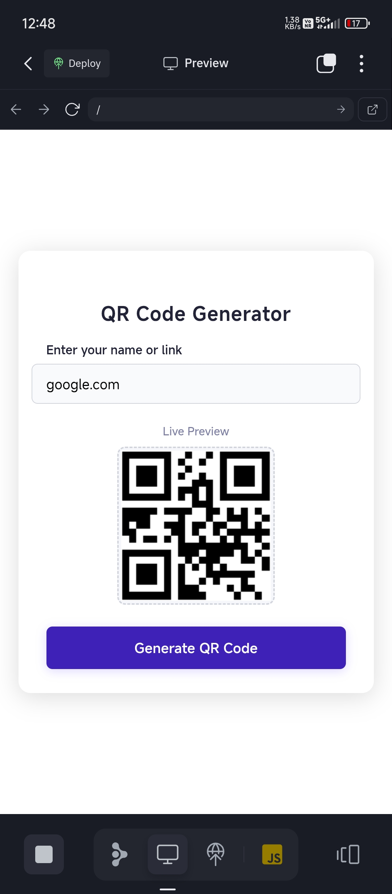

# QR Code Generator

This is a simple QR Code Generator built using HTML, CSS, and JavaScript. It allows you to generate QR codes for any text or URL. The project was created and tested entirely on a mobile device, so appearance and usability may vary on desktops or other devices.

## Features

- **Generate QR codes** instantly for any input text or URL.
- **Download the generated QR code** as an image.
- **Responsive design** for mobile usage.

## Getting Started

1. **Clone the repository** or download the project files.
2. Open `index.html` in your browser (preferably on your mobile device for best experience).
3. Enter the text or URL you want to convert into a QR code.
4. Click the "Generate" button to see your QR code.
5. Use the download button to save your QR code as an image.

## Technologies Used

- **HTML** for the structure.
- **CSS** for styling.
- **JavaScript** for QR code generation logic.

## Screenshot

Below is an example screenshot of the QR Code Generator interface:

## Notes

- This project was built and tested on a phone. If you encounter UI issues on desktop, consider using it on mobile or modifying the CSS for desktop compatibility.
- You may need an internet connection if external QR code libraries are used.

## License

This project is open source and free to use.

---

*If you find any issues or have suggestions, feel free to open an issue or contribute!*
