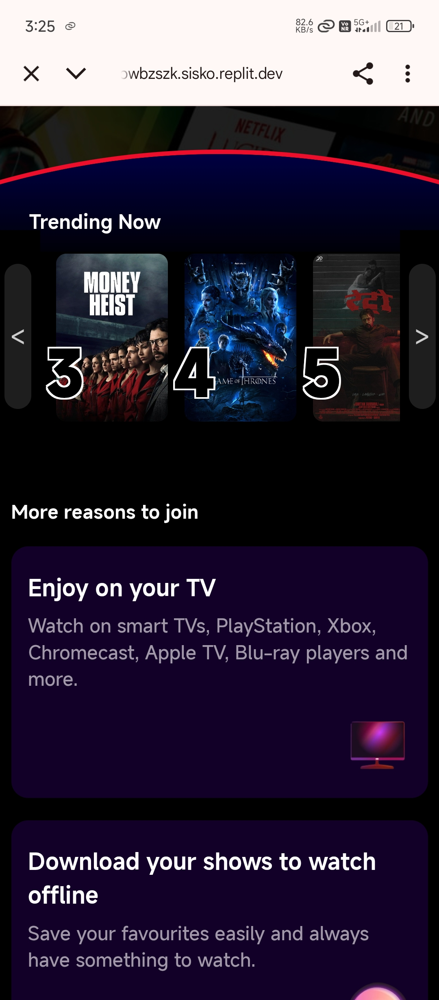
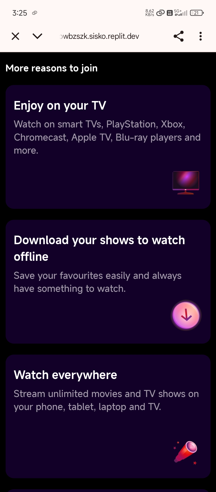

# Netflix Clone

This project is a simple **Netflix Clone** built using HTML, CSS, and JavaScript. The goal of this project was to practice web development skills—especially UI recreation—using only a mobile phone for development and testing

## Features

- **Home Page:** Mimics the look and feel of the Netflix landing page.
- **Movie Cards:** Display sample movies with images, titles, and genres.
- **Basic Navigation:** Includes simple navigation bar and footer.

## Screenshots

### Netflix

_(If you have more images or different formats, add or adjust filenames as needed.)_

## How to Use

1. Clone this repository or download the code.
2. Open the `index.html` file in your browser.
3. Browse the clone and explore its features.

## Limitations

- **Device Compatibility:** This project was built and tested on a mobile phone, so it may not work perfectly on all devices or browsers.
- **No Backend:** All data is static and there is no authentication or backend logic.
- **Learning Project:** The code may not follow best practices or be fully optimized.

## Credits

Inspired by the Netflix UI for educational purposes.

---

**Note:** This project is made only for learning purposes.  
If you are looking for a clean and understandable Netflix clone codebase, please check other clone repositories on GitHub.

