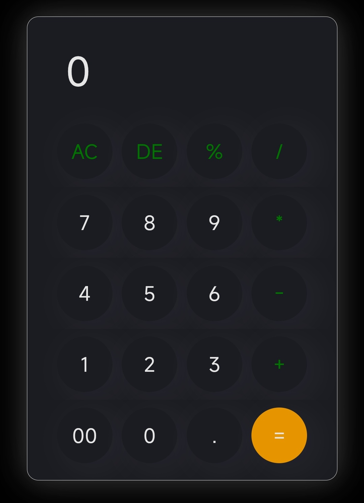

# Calculator Web App

This is a simple calculator web app built using HTML, CSS, and JavaScript. It is designed to perform basic arithmetic operations such as addition, subtraction, multiplication, and division. This project is part of my collection of web development mini projects, all created and tested on a mobile device.

## Features

- Responsive design for mobile devices
- Basic arithmetic operations (+, -, ×, ÷)
- Clear and delete functionality
- User-friendly interface

## Screenshots

> *(Add more screenshots of your calculator app here if available)*

## Usage

1. Clone the repository or download the calculator project folder.
2. Open the `index.html` file in your web browser.
3. Use the calculator by clicking/tapping the buttons.

## Technologies Used

- HTML
- CSS
- JavaScript

## How it Works

- The interface consists of display and buttons for digits and operations.
- JavaScript handles the logic for calculations and updates the display.
- CSS styles the calculator for a pleasant and mobile-friendly experience.

## Limitations

- This calculator was built and tested on a mobile phone. It may not display or work perfectly on all desktop devices or browsers.

## Contributing

If you find any issues or want to suggest improvements, feel free to open an issue or submit a pull request!

## License

This project is open source and available under the [MIT License](LICENSE).

---

*Created by [Praveen Pradhan](https://github.com/Praveen-Pradhan)*
